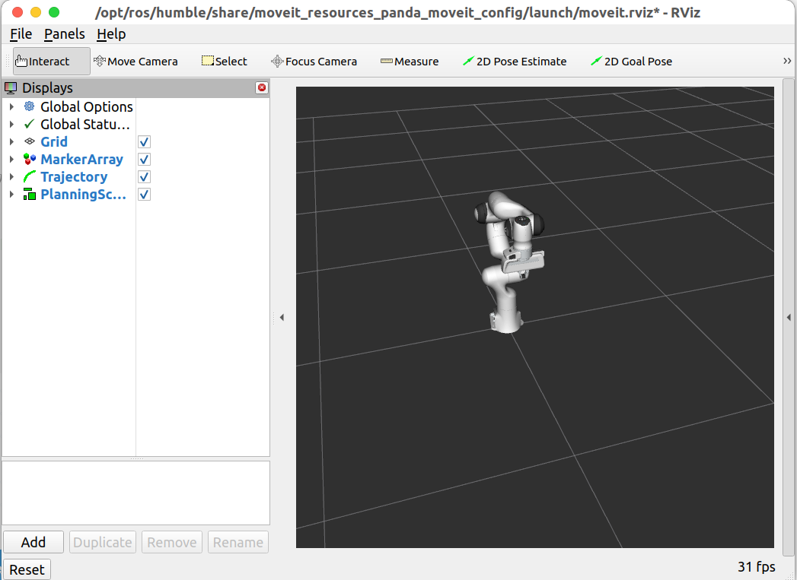

[toc]

# 1. 安装

```bash
# 安装核心包和示例 Panda 机械臂
sudo apt install ros-humble-moveit \
				 ros-humble-moveit-setup-assistant \
                 ros-humble-ros2-control \
                 ros-humble-ros2-controllers \
                 ros-humble-controller-manager \
                 ros-humble-joint-state-broadcaster \
                 ros-humble-joint-trajectory-controller \
                 ros-humble-moveit-simple-controller-manager \
                 ros-humble-moveit-resources-panda-moveit-config \
                 ros-humble-moveit-resources-panda-description
                 
# 更换为 MoveIt2 官方推荐的 DDS
sudo apt install ros-humble-rmw-cyclonedds-cpp
echo "export RMW_IMPLEMENTATION=rmw_cyclonedds_cpp" >> ~/.bashrc

# 如果需要导入点云用于避障规划，则安装相关包
sudo apt install ros-humble-moveit-ros-perception
sudo apt install ros-humble-moveit-ros-occupancy-map-monitor
sudo apt install ros-humble-pcl-ros
sudo apt install ros-humble-depth-image-proc
sudo apt install ros-humble-perception-pcl

# 验证是否安装成功
ros2 pkg list | grep moveit
```

-   **教程 + 文档**：[MoveIt2 Documentation](https://moveit.picknik.ai/main/index.html)

# 2. Rviz

## 2.1. 启动演示及配置插件

-   终端输入 `ros2 launch moveit_resources_panda_moveit_config demo.launch.py` 启动机械臂演示：
-   
-   `Add` 添加显示类型，一般基础的默认已存在，需要自行添加应用于 `MoveIt` 的主要是 `MotionPlanning`、`TF`、`Axes`

## 2.2. 显示类型

-   **MotionPlanning** 是 MoveIt 的专用 RViz 插件（Display Type），提供最完整的交互式运动规划界面。 主要功能包括：
    -   可视化并编辑 **Planning Scene**（规划场景，包括机器人当前状态、附加物体、碰撞物体、已知物体等）。
    -   交互设置 **Start State**（起始位姿，通常默认为当前机器人状态）和 **Goal State**（目标位姿，可通过拖拽末端执行器或设置关节角度交互修改）。
    -   选择规划组（Planning Group）、规划器（Planner）、规划参数，并一键 **Plan**（生成轨迹）。
    -   显示生成的 **Planned Path**（规划路径，通常以橙色/绿色线条或动画显示）。
    -   支持 **Execute**（执行规划路径到真实机器人或仿真）。
    -   包含多个子选项卡：Context（上下文配置）、Planning（规划设置）、Scene Objects（场景物体管理）、Query（查询起始/目标状态）、Status（规划状态反馈）。
    -   典型配置：Robot Description → "robot_description"；Trajectory Topic → "/move_group/display_planned_path" 或 "/display_planned_path"；Planning Scene Topic → "monitored_planning_scene" 或 "planning_scene"。 → 这是 MoveIt 用户最核心的插件，几乎所有交互式规划调试都依赖它。

-   **TF** 显示整个 TF（变换树）坐标系关系。 主要功能：

    -   以坐标轴形式可视化所有广播的坐标系（frame）及其父子关系（树状结构）。

    -   帮助快速检查坐标变换是否正确，例如 base_link → tool0 → wrist → end_effector 等链路。

    -   在 MoveIt 中非常重要：用于验证末端位姿、规划帧是否对齐、是否存在 TF 断链或延迟问题。 → 推荐始终添加，并启用 "Show Names" 和 "Show Axes" 以便观察。

-   **Axes** 显示一组固定的三维坐标轴（X红、Y绿、Z蓝）。 主要功能：

    -   作为参考坐标系，帮助判断当前 Fixed Frame 的方向和原点位置。

    -   在 MoveIt 调试中常用于确认规划帧（通常设为 /base_link 或 /world）的朝向是否正确。 → 简单但实用，常与 TF 一起使用作为全局参考。

-   **PlanningScene**（或 Scene Robot / Planning Scene Robot） 这是 **MotionPlanning** 插件内部的子显示选项（在 MotionPlanning 的 Displays 属性中展开）。 主要功能：

    -   显示当前规划场景中的机器人模型（Scene Robot）。
    -   可单独开关：Show Robot Visual（可视几何体）、Show Robot Collision（碰撞体，通常半透明）、Octree / Attached / World Objects（附加物体、世界物体）。 → 用于检查场景是否正确更新、碰撞检测是否生效。

-   **Trajectory**（或 Planned Path） 也是 **MotionPlanning** 插件内部的子显示选项（Planned Path 部分）。 主要功能：

    -   显示规划出的轨迹（通常为一系列关节插值点，以线条、动画或轨迹尾迹形式渲染）。

    -   支持 Loop Animation（循环播放轨迹）、Fade Animation（渐隐效果）、轨迹颜色/粗细调整。

    -   可通过 Trajectory Slider（Panel → Motion Planning → Trajectory Slider）手动拖动预览轨迹的每一步。 → 规划成功后，这是最直观的轨迹可视化结果。

# 3. URDF

## 3.1. 模型与 urdf 文件

-   **目录结构：**

    ```bash
    model/
    ├── meshes/
    |	├── collision/
    |	|	├── base_link.stl
    |	|	└── xxx.stl
    |	└── visual/
    |		├── base_link.dae
    |		└── xxx.dae
    └──	urdf/
    	└── <robot-name>_description.urdf.xacro		(如原来就有 urdf 则继续使用 .urdf)
    ```

>   *注意 urdf 里所有参数都要用浮点数，原 MoveIt1 可用而 MoveIt2 不可用*

-   **KDL 相关警告：**

    -   `base_link has an inertia specified ... KDL does not support a root link with an inertia` 表示根链接带惯量，建议加个无惯量 `dummy root link` 作为根链接（不改也能用）

        ```xml
        	<link name="base_link" />
            <link name="base_body">
                <!-- 原 base_link 内容，含惯量 -->
            </link>
            <joint name="base_joint" type="fixed">
                <parent link="base_link" />
                <child link="base_body" />
                <origin xyz="0 0 0" rpy="0 0 0" />
            </joint>
            <link name="link_1">
                <!-- link_1 内容 -->
            </link>
            <joint name="joint1" type="revolute">
                <origin xyz="0 0 0.0533" rpy="0 0 0" />
                <parent link="base_body" />
                <child link="link_1" />
                <axis xyz="0 0 -1" />
                <limit lower="-2.0944" upper="2.0944" effort="100" velocity="3" />
            </joint>
        ```

## 3.2. 机器人描述包 + Rviz 验证

-   **创建描述包：** 

    ```bash
    # 如果未安装相关依赖，则先安装
    sudo apt install ros-humble-joint-state-publisher-gui
    # 进入 src
    cd src
    # 创建
    ros2 pkg create --build-type ament_cmake <robot-name>_description --dependencies urdf xacro robot_state_publisher joint_state_publisher_gui
    ```

-   **目录结构：**

    ```bash
    <robot-name>_description/
    ├── CMakeLists.txt
    ├── package.xml
    ├── meshes/
    ├── urdf/
    │   ├── <robot-name>_description.urdf.xacro		← 主文件（xacro 或 urdf）
    │   ├── materials.xacro							← 可选
    │   ├── macros/									← 可选
    │   └── ...
    ├── launch/
    │   └── display.launch.py						← 用于 rviz 可视化检查
    └── config/
        └── joint_names.yaml						← 可选
    ```

-   **修改 CmakeLists.txt：**

    ```cmake
    cmake_minimum_required(VERSION 3.8)
    project(dm_arm_description)
    
    if(CMAKE_COMPILER_IS_GNUCXX OR CMAKE_CXX_COMPILER_ID MATCHES "Clang")
      add_compile_options(-Wall -Wextra -Wpedantic)
    endif()
    
    # find dependencies
    find_package(ament_cmake REQUIRED)
    find_package(urdf REQUIRED)
    find_package(xacro REQUIRED)
    find_package(robot_state_publisher REQUIRED)
    
    ##########################################################
    ## 注释掉 joint_state_publisher_gui，因为是运行时节点而非依赖 ##
    ### find_package(joint_state_publisher_gui REQUIRED)   ###
    ##########################################################
    
    if(BUILD_TESTING)
      find_package(ament_lint_auto REQUIRED)
      # the following line skips the linter which checks for copyrights
      # comment the line when a copyright and license is added to all source files
      set(ament_cmake_copyright_FOUND TRUE)
      # the following line skips cpplint (only works in a git repo)
      # comment the line when this package is in a git repo and when
      # a copyright and license is added to all source files
      set(ament_cmake_cpplint_FOUND TRUE)
      ament_lint_auto_find_test_dependencies()
    endif()
    
    ############################
    ## 安装 URDF、meshes 等资源 ##
    ############################
    install(
      DIRECTORY urdf meshes launch config
      DESTINATION share/${PROJECT_NAME}
    )
    
    ament_package()
    
    ```

-   **添加 display.launch.py：**

    ```python
    from launch import LaunchDescription
    from launch.substitutions import Command, PathJoinSubstitution
    from launch_ros.actions import Node
    from launch_ros.substitutions import FindPackageShare
    
    URDF_PATH = "dm_arm_description.urdf"
    
    
    def generate_launch_description():
        # 查找包路径
        pkg_share = FindPackageShare("dm_arm_description").find("dm_arm_description")
    
        # URDF 文件路径
        urdf_path = PathJoinSubstitution([pkg_share, "urdf", URDF_PATH])
    
        # 判断是否使用 xacro
        use_xacro = True if URDF_PATH.endswith(".xacro") else False
    
        return LaunchDescription(
            [
                # 从 URDF 加载并发布 robot_description
                Node(
                    package="robot_state_publisher",
                    executable="robot_state_publisher",
                    name="robot_state_publisher",
                    output="screen",
                    parameters=[
                        {
                            "robot_description": (
                                Command(["xacro ", urdf_path])
                                if use_xacro
                                else Command(["cat ", urdf_path])
                            )
                        }
                    ],
                ),
                # 启动 joint_state_publisher_gui
                Node(
                    package="joint_state_publisher_gui",
                    executable="joint_state_publisher_gui",
                    name="joint_state_publisher_gui",
                    output="screen",
                ),
                # 启动 RViz 并加载配置
                Node(
                    package="rviz2",
                    executable="rviz2",
                    name="rviz2",
                    output="screen",
                    arguments=[
                        "-d",
                        PathJoinSubstitution([pkg_share, "config", "view_robot.rviz"]),
                    ],
                ),
            ]
        )
    
    ```

-   **构建并 source：** `colcon build --symlink-install --packages-select <robot-name>_description`

-   **运行 display.launch.py：** `ros2 launch dm_arm_description display.launch.py `

    -   选择 `Global Options/Fixed Frame` 为基座：

    -   添加 `RobotModel` 并选择 `RobotModel/Description Topic` 为 `/robot_description`

        >   *如果没显示则是未及时更新，可点一下其他选项刷新*

## 3.3. MoveIt Config 包

### 3.3.1. MoveIt Setup Assistant

-   **启动：** `ros2 launch moveit_setup_assistant setup_assistant.launch.py`
-   **新建：** `Create New` -> `Browse` -> `<robot-name>_description.urdf` -> `Load File`
-   **Self-Collisions：** `Generate Collision Matirx`
-   **Planning Groups：** `Add Group`
    -   **arm：** `KDL` -> `RRTConnect` -> `Add Kin. Chain` (`base_link` -> `link_tcp` 即底座 - 末端工作点)
    -   **gripper：** `Add Joints` -> `gripper_left` （`gripper_right` 是 mimic joint 不需要加进来）
-   **Robot Poses：** `Add` -> `home`
-   **End Effectors：** `Add` -> `Name=gripper` -> `Group=gripper` -> `Link=link_tcp` -> `Parent=arm`
-   **ROS2 Controllers：** `Auto` 
    -   **arm：** `joint_trajectory_controller/JointTrajectoryController`
    -   **gripper：** `position_controllers/GripperActionController`

-   **MoveIt Controllers：** `Auto`
    -   **arm：** `FollowJointTrajectory`
    -   **gripper：** `GripperCommand`

-   剩下个必填项为作者信息，按实际情况填即可
-   在 `src/` 下新建 `<robot-name>_moveit_config/` 包用于存放生成的 SRDF，保存后构建并 `Source`
-   `ros2 launch dm_arm_moveit_config demo.launch.py` 验证

>   -   *如果 setup_assistant 加载 urdf file 时报错 QT 相关的错误，需要降级 ros-humble-rviz-common*
>
>   -   *如果仍然有 parameter 'robot_description_planning.joint_limits.joint1.max_velocity'*
>       *has invalid type: expected [double] got [integer] 报错，则在 config/joint_limits.yaml*
>       *里将整数补齐为浮点数后再构建并 Source*
>       
>   -   *如果有 No action namespace specified for controller ... through parameter ... 报错，需要*
>
>       *在 \<robot-name\>_moveit_config/config/moveit_controller.yaml 里的每个 controller 里添加：*
>
>       *action_ns: ...(对应你的配置，如 follow_joint_trajectory)*

### 3.3.2. MoveIt Setup Assistant 其他可选选项


### 3.3.3. 生成文件结构说明

Setup Assistant 完成后会在 `<robot-name>_moveit_config/config/` 下生成以下关键文件，了解它们的作用有助于后续手动调整：

| 文件                      | 作用                                       |
| ------------------------- | ------------------------------------------ |
| `<robot>.srdf`            | 规划组定义、碰撞豁免、预设姿态、末端执行器 |
| `joint_limits.yaml`       | 关节速度/加速度上限，覆盖 URDF 中的值      |
| `kinematics.yaml`         | IK 求解器配置（插件名、超时、搜索步长）    |
| `ompl_planning.yaml`      | OMPL 规划器参数，默认使用 RRTConnect       |
| `ros2_controllers.yaml`   | ros2_control 的 controller 定义            |
| `moveit_controllers.yaml` | MoveIt 侧的 controller 接口配置            |
| `moveit.rviz`             | RViz 预配置，含 MotionPlanning 插件        |

### 3.3.4. kinematics.yaml 关键参数

生成后可手动微调 `config/kinematics.yaml`，KDL 的两个参数影响 IK 成功率：

```yaml
arm:
  kinematics_solver: kdl_kinematics_plugin/KDLKinematicsPlugin
  kinematics_solver_search_resolution: 0.005   	# 搜索步长，越小越精确但越慢
  kinematics_solver_timeout: 0.005             	# 单次 IK 超时（秒），复杂位姿可调到 0.05
  kinematics_solver_attempts: 3               	# 超时后重试次数
```

如果 KDL 在某些奇异构型下 IK 频繁失败，可以将求解器换为 `trac_ik_kinematics_plugin/TRAC_IKKinematicsPlugin`（需额外安装 `ros-humble-trac-ik-kinematics-plugin`），参数格式相同，收敛性更好，对近奇异点的处理比 KDL 稳定

### 3.3.5. 仿真与真实臂的切换

Setup Assistant 生成的 `ros2_controllers.yaml` 默认使用 `mock_components/GenericSystem`（即 FakeSystem）用于仿真；切换到真实臂时**不需要重新跑 Setup Assistant**，只需替换 hardware interface：

```yaml
# 仿真（config/ros2_controllers.yaml 或 description 包内的 .ros2_control.xacro）
ros2_control:
  hardware:
    plugin: mock_components/GenericSystem   # FakeSystem，纯仿真

# 真实臂（后续重构硬件接口后替换为）
ros2_control:
  hardware:
    plugin: dm_arm_hardware/DmHardwareInterface
    # 其余 joint 定义、SRDF、Planning Group 完全不变
```

MoveIt 规划层（SRDF、kinematics.yaml、ompl_planning.yaml）与硬件接口完全解耦，切换硬件不影响规划配置

### 3.3.6. mimic joint 处理

`gripper_right` 在 URDF 中声明了 `<mimic joint="gripper_left">`，但 `mock_components/GenericSystem` 默认不处理 mimic 关系，仿真时两指可能不同步。在 `ros2_controllers.yaml` 的 gripper controller 下添加：

```yaml
gripper_controller:
  ros__parameters:
    joints:
      - gripper_left
    command_interfaces:
      - position
    state_interfaces:
      - position
      - velocity
    allow_partial_joints_goal: true
```

## 3.4. 纯 urdf 迁移为 xacro

-   **目的：**把 `.urdf` 改为 `.urdf.xacro`，分离出 `dm_arm.ros2_control.xacro`，通过 launch 参数控制仿真/真实切换，方便后续维护和调试
-   **改造步骤：**把 URDF 主文件改成 xacro 格式 -> 新建一个专门放 ros2_control 描述的 xacro 文件 -> 重新对 xacro 文件再配置一次 MoveIt Config 

### 3.4.1.把 URDF 主文件改成 xacro 格式

-   **重命名：** `<robot-name>_description.urdf.xacro`

-   然后在文件**第二行**（`<robot>` 标签里）加上 xacro 命名空间声明：

    ```xml
    <!-- 原来 -->
    <robot name="<robot-name>_description">
    
    <!-- 改为 -->
    <robot name="<robot-name>_description" xmlns:xacro="http://www.ros.org/wiki/xacro">
    ```

-   然后在文件**末尾** `</robot>` 前加两行，引入 ros2_control 描述：

    ```bash
    <!-- 引入 ros2_control 描述 -->
      <xacro:arg name="use_fake_hardware" default="true"/>
      <xacro:include filename="$(find <robot-name>_description)/urdf/<robot-name>.ros2_control.xacro"/>
      <xacro:<robot-name>_ros2_control name="<robot-name>_hardware" use_fake_hardware="$(arg use_fake_hardware)"/>
    
    </robot>
    ```

### 3.4.2. 新建 \<robot-name\>.ros2_control.xacro

在 `urdf/` 下新建文件并添加：

```xml
<?xml version="1.0"?>
<robot xmlns:xacro="http://www.ros.org/wiki/xacro">

    <xacro:macro name="dm_arm_ros2_control" params="name use_fake_hardware:=true">

        <ros2_control name="${name}" type="system">
            <!-- 硬件插件选择 -->
            <hardware>
                <!-- 仿真模式 -->
                <xacro:if value="${use_fake_hardware}">
                    <plugin>mock_components/GenericSystem</plugin>
                </xacro:if>
                <!-- 真实硬件模式 -->
                <xacro:unless value="${use_fake_hardware}">
                    <plugin>dm_arm_hardware/DmHardwareInterface</plugin>
                    <param name="serial_port">/dev/ttyACM0</param>
                    <param name="baudrate">921600</param>
                    <param name="control_frequency">500.0</param>
                </xacro:unless>
            </hardware>

            <!-- 关节名称（必须与 URDF 里的 joint name 一致） -->
            <joint name="joint1">
                <command_interface name="position"/>
                <state_interface name="position">
                    <param name="initial_value">0.0</param>
                </state_interface>
                <state_interface name="velocity"/>
                <state_interface name="effort"/>
            </joint>
			<!-- joint2 ~ joint6 -->
            <joint name="gripper_left">
                <command_interface name="position"/>
                <state_interface name="position">
                    <param name="initial_value">0.0</param>
                </state_interface>
                <state_interface name="velocity"/>
                <state_interface name="effort"/>
            </joint>
        </ros2_control>

    </xacro:macro>

</robot>
```

### 3.4.3. 重复之前的操作配置 MoveIt Config


# 4. 基础空间规划

## 4.1. 设置目标关节角度

### 4.1.1. 依赖

```xml
    <depend>rclcpp</depend>
    <depend>moveit_ros_planning_interface</depend>
```

-   **VSCode 路径：**Ctrl + Shift + P 并输入 `C/C++` 选择编辑配置(JSON)：

    ```json
                "includePath": [
                    "${workspaceFolder}/**",
                    "/opt/ros/humble/include/**",
                    "/usr/include/**"
                ],
    ```

-   **include：** `#include <rclcpp/rclcpp.hpp>`  `#include <moveit/move_group_interface/move_group_interface.h>`

### 4.1.2. 步骤与 API

-   **步骤：** `新建节点` -> `单开线程并 Node Spin` -> `创建 MoveGroupInterface 对象` -> `设置目标关节+规划执行`

-   **API：**

    ```cpp
    # 节点
    auto node = rclcpp::Node::make_shared("end_effector_cmd");
    
    # 线程
    rclcpp::executors::SingleThreadedExecutor executor;
    executor.add_node(node);
    std::thread spin_thread([&executor]() { executor.spin(); });
    
    # MoveGroupInterface 对象
    moveit::planning_interface::MoveGroupInterface arm(node, "arm");
    
    # 获取关节角与关节名称
    std::vector<double> current_joints = arm.getCurrentJointValues();
    std::vector<std::string> joint_names = arm.getJointNames();
    
    # 设置目标关节角
    bool success = arm.setJointValueTarget(target_joints);
    
    # 规划
    moveit::planning_interface::MoveGroupInterface::Plan plan;
    moveit::core::MoveItErrorCode err_code = arm.plan(plan);
    
    # 执行
    err_code = arm.execute(plan);
    
    # 关闭节点 + 终止线程
    rclcpp::shutdown();
    spin_thread.join();
    ```

## 4.2. 设置目标位姿

### 4.2.1. 传入 MoveIt2 所有配置参数：

-   在 MoveIt 2 (ROS 2) 中，**全局参数服务器（Parameter Server）已不存在**；每个节点都是独立的实体，必须在启动时显式获取其所需的全部上下文参数：

    ```python
    # run.launch.py
    from launch import LaunchDescription
    from launch_ros.actions import Node
    from moveit_configs_utils import MoveItConfigsBuilder
    
    
    def generate_launch_description():
        # 构建 MoveIt 配置
        moveit_config = MoveItConfigsBuilder(
            "dm_arm_description", package_name="dm_arm_moveit_config"
        ).to_moveit_configs()
    
        # 创建节点并传入 moveit_config.to_dict()
        node = Node(
            package="dm_arm_controller",
            executable="end_effector_cmd",
            output="screen",
            parameters=[
                moveit_config.to_dict(),
                {"use_sim_time": True},
            ],
        )
    
        return LaunchDescription([node])
    
    ```

### 4.2.2. 设置目标 Pose / Position / Orientation

```cpp
using TargetVariant = std::variant<
    geometry_msgs::msg::Pose,
    geometry_msgs::msg::Point,
    geometry_msgs::msg::Quaternion
>;
/**
 * @brief 设置末端执行器的目标位姿、位置或姿态
 * @param target 目标位姿、位置或姿态(geometry_msgs::msg::Pose / geometry_msgs::msg::Point / geometry_msgs::msg::Quaternion)
 * @return 设置是否成功
 */
bool ArmController::set_target(const TargetVariant& target) {
    bool success = false;

    if(auto* pose = std::get_if<geometry_msgs::msg::Pose>(&target)) {
        success = _arm_.setPoseTarget(*pose);
    }
    else if(auto* point = std::get_if<geometry_msgs::msg::Point>(&target)) {
        success = _arm_.setPositionTarget(point->x, point->y, point->z);
    }
    else if(auto* quat = std::get_if<geometry_msgs::msg::Quaternion>(&target)) {
        success = _arm_.setOrientationTarget(quat->x, quat->y, quat->z, quat->w);
    }
    else { return false; }

    return success;
}
```

### 4.2.3. RPY 转四元数

-   MoveIt2 的接口要求使用四元数，避免欧拉角的万向锁以及插值不连续问题
-   RPY 转四元数基于 TF2 (ROS 2 的坐标变换)：

```cpp
/**
 * @brief 将 Roll-Pitch-Yaw 角转换为四元数
 * @param roll 滚转角（绕 X 轴旋转）
 * @param pitch 俯仰角（绕 Y 轴旋转）
 * @param yaw 偏航角（绕 Z 轴旋转）
 * @return 转换后的四元数
 */
geometry_msgs::msg::Quaternion ArmController::rpy_to_quaternion(double roll, double pitch, double yaw) {
    tf2::Quaternion quat;
    quat.setRPY(roll, pitch, yaw);
    quat.normalize();

    geometry_msgs::msg::Quaternion quat_msg;
    quat_msg.x = quat.x();
    quat_msg.y = quat.y();
    quat_msg.z = quat.z();
    quat_msg.w = quat.w();

    return quat_msg;
}
```

## 4.3. TF 坐标变换

### 4.3.1. 作用

-   在 ROS2 中，坐标变换由 tf2 系统维护，核心思想：维护一棵坐标系树（Transform Tree）
-   TF 处理连杆之间的随时间变化的齐次变换矩阵，所以必须要有时间戳，所有 API 都要求有时间戳
-   **依赖：** `tf2_geometry_msgs`
-   **include：** `tf2_ros` 

### 4.3.2. 相关 API

-   **初始化：**

    ```cpp
    std::shared_ptr<tf2_ros::Buffer> _tf_buffer_;
    std::shared_ptr<tf2_ros::TransformListener> _tf_listener_;
    
    _tf_buffer_ = std::make_shared<tf2_ros::Buffer>(_node_->get_clock());
    _tf_listener_ = std::make_shared<tf2_ros::TransformListener>(*_tf_buffer_);
    ```

-   **查询并执行两坐标系之间的变换：**

    ```cpp
    geometry_msgs::msg::TransformStamped tf = _tf_buffer_->lookupTransform(target, source, time);
    tf2::doTransform(in, out, transform);
    
    // 异常：
        tf2::LookupException
        tf2::ExtrapolationException
        tf2::ConnectivityException
    ```

-   **更高层变换 API：** `_tf_buffer_->transform(in, target_frame);`

### 4.3.3. 代码

```cpp
/**
 * @brief 将输入的位姿、位置或姿态从底座坐标系转换到末端执行器坐标系
 * @param in 输入的位姿、位置或姿态(geometry_msgs::msg::Pose / geometry_msgs::msg::Point / geometry_msgs::msg::Quaternion / geometry_msgs::msg::PoseStamped)
 * @param out 转换后的位姿、位置或姿态(geometry_msgs::msg::Pose / geometry_msgs::msg::Point / geometry_msgs::msg::Quaternion / geometry_msgs::msg::PoseStamped)
 * @return 转换是否成功
 */
template<class T>
bool ArmController::base_to_end_tf(const T& in, T& out) {
    // 检查输入类型
    static_assert(
        std::is_same_v<T, geometry_msgs::msg::Pose> ||
        std::is_same_v<T, geometry_msgs::msg::Point> ||
        std::is_same_v<T, geometry_msgs::msg::Quaternion> ||
        std::is_same_v<T, geometry_msgs::msg::PoseStamped>,
        "仅支持 Pose(Stamped)、Point 和 Quaternion 的坐标变换");

    try {
        // 带时间戳则直接变换
        if constexpr(std::is_same_v<T, geometry_msgs::msg::PoseStamped>) {
            auto tf_stamped = _tf_buffer_->lookupTransform(_eef_link_, _base_link_, in.header.stamp);
            tf2::doTransform(in, out, tf_stamped);
        }
        // 不带时间戳则构造 PoseStamped 进行变换后提取
        else {
            geometry_msgs::msg::PoseStamped pose_in;
            pose_in.header.frame_id = _base_link_;
            pose_in.header.stamp = _node_->now();

            // 构造 PoseStamped
            if constexpr(std::is_same_v<T, geometry_msgs::msg::Pose>) {
                pose_in.pose = in;
            }
            else if constexpr(std::is_same_v<T, geometry_msgs::msg::Point>) {
                pose_in.pose.position = in;
                pose_in.pose.orientation.w = 1.0;
            }
            else if constexpr(std::is_same_v<T, geometry_msgs::msg::Quaternion>) {
                pose_in.pose.orientation = in;
            }

            // 进行坐标变换
            geometry_msgs::msg::PoseStamped pose_out = _tf_buffer_->transform(pose_in, _eef_link_);
            if constexpr(std::is_same_v<T, geometry_msgs::msg::Pose>) {
                out = pose_out.pose;
            }
            else if constexpr(std::is_same_v<T, geometry_msgs::msg::Point>) {
                out = pose_out.pose.position;
            }
            else if constexpr(std::is_same_v<T, geometry_msgs::msg::Quaternion>) {
                out = pose_out.pose.orientation;
            }
        }
        RCLCPP_INFO(_node_->get_logger(), "坐标变换成功：%s -> %s", _base_link_.c_str(), _eef_link_.c_str());
        return true;
    }
    catch(const tf2::TransformException& e) {
        RCLCPP_ERROR(_node_->get_logger(), "坐标变换失败：%s", e.what());
        return false;
    }
}
```

## 4.4. 参数配置

在功能包里增加 `config/params.yaml` 文件，并按照以下格式：

```yaml
/**:								# 表示所有节点均可使用
  ros__parameters:					# 声明为 ros 的参数服务

    motion_planning:				# 键值对
      planning_time: 5.0			# 获取时用 "." 来表示包含
      planning_attempts: 10			# 先声明再获取

    target_tolerance:				# _node_->declare_parameter("tf.timeout", 0.1); 
      position: 0.001				# a = _node_->get_parameter("tf.timeout", 0.1);
      orientation: 0.01
      joint: 0.01
```

# 5. 笛卡尔空间约束规划

## 5.1. 笛卡尔路径规划 (Cartesian Path)

​	在笛卡尔空间中，我们通常希望机械臂末端按照特定的几何轨迹（如直线、曲线）运动，而不是仅仅关心起点和终点；MoveIt2 提供了 `computeCartesianPath` 接口来实现这一功能

-   **核心 API：**
  
    ```cpp
    double success_rate = arm.computeCartesianPath(waypoints, eef_step, jump_threshold, trajectory);
    ```
    -   `waypoints`：`std::vector<geometry_msgs::msg::Pose>`，包含一系列期望经过的路径点
    -   `eef_step`：末端执行器在笛卡尔空间中的最大步长（如 `0.01` 米），MoveIt 会在路径点之间按此步长进行插值
    -   `jump_threshold`：关节空间跳跃阈值（如 `0.0` 表示禁用）；用于防止逆运动学（IK）求解时相邻两点关节角度突变
    -   `trajectory`：输出的轨迹（`moveit_msgs::msg::RobotTrajectory`）
    -   **返回值**：`0.0 ~ 1.0` 之间的浮点数，表示成功规划的路径比例（`1.0` 表示 100% 成功）

## 5.2. 轨迹时间参数化 (Time Parameterization)

​	`computeCartesianPath` 生成的轨迹默认缺乏平滑的速度和加速度信息，直接执行可能会导致机械臂运动卡顿或报错。因此，必须对生成的轨迹进行**时间参数化**

-   **依赖头文件：**
    ```cpp
    #include <moveit/trajectory_processing/time_optimal_trajectory_generation.h>
    #include <moveit/trajectory_processing/iterative_spline_parameterization.h>
    #include <moveit/robot_trajectory/robot_trajectory.h>
    ```

-   **常用方法：**
    1.  **TOTG (Time-Optimal Trajectory Generation)**：时间最优轨迹生成，速度较快，适合大多数场景
    2.  **ISP (Iterative Spline Parameterization)**：迭代样条参数化，生成的轨迹更加平滑，但要求更严格且速度慢

-   **代码：**
  
    ```cpp
    // 将 moveit_msgs::msg::RobotTrajectory 转换为 robot_trajectory::RobotTrajectory
    robot_trajectory::RobotTrajectory rt(arm.getRobotModel(), arm.getName());
    rt.setRobotTrajectoryMsg(*arm.getCurrentState(), trajectory);
    
    // 选择时间参数化方法并计算时间戳
    trajectory_processing::TimeOptimalTrajectoryGeneration totg;
    bool success = totg.computeTimeStamps(rt, vel_scale, acc_scale);
    
    // 或者使用 ISP 方法：
    // trajectory_processing::IterativeSplineParameterization isp;
    // bool success = isp.computeTimeStamps(rt, vel_scale, acc_scale);
    
    // 将参数化后的轨迹转换回消息格式
    rt.getRobotTrajectoryMsg(trajectory);
    ```

## 5.3. 直线与曲线轨迹示例

### 5.3.1. 直线轨迹

​	直线轨迹只需将起点和终点加入 `waypoints` ，MoveIt 会自动在两点间进行直线插值

```cpp
std::vector<geometry_msgs::msg::Pose> waypoints;
waypoints.push_back(start_pose);
waypoints.push_back(end_pose);

moveit_msgs::msg::RobotTrajectory trajectory;
double success_rate = arm.computeCartesianPath(waypoints, 0.01, 0.0, trajectory);
```

### 5.3.2. 曲线轨迹

​	MoveIt 原生 API 不直接支持“画圆”，但我们可以通过数学公式（二次贝塞尔曲线或曲线插值）在起点、途经点和终点之间生成一系列离散的位姿点，然后交由 `computeCartesianPath` 处理

​	二次贝塞尔曲线取一系列离散位置：$P(t)=(1−t)^2 \cdot P_0 + 2(1−t)t \cdot P_1+t^2 \cdot P_2, ~~~~~ t\in(0,1)$

​	姿态由

```cpp
std::vector<geometry_msgs::msg::Pose> waypoints;
int curve_segments = 30; // 分段数

for(int i = 0; i <= curve_segments; ++i) {
    double t = static_cast<double>(i) / curve_segments;
    geometry_msgs::msg::Pose point;
    
    // 使用二次贝塞尔曲线公式计算曲线路径上的点
    point.position.x = (1 - t) * (1 - t) * start_pose.position.x + 2 * (1 - t) * t * via_pose.position.x + t * t * end_pose.position.x;
    point.position.y = (1 - t) * (1 - t) * start_pose.position.y + 2 * (1 - t) * t * via_pose.position.y + t * t * end_pose.position.y;
    point.position.z = (1 - t) * (1 - t) * start_pose.position.z + 2 * (1 - t) * t * via_pose.position.z + t * t * end_pose.position.z;
    
    // 对姿态进行球面线性插值
    tf2::Quaternion quat_start, quat_end, quat_interp;
    tf2::fromMsg(start_pose.orientation, quat_start);
    tf2::fromMsg(end_pose.orientation, quat_end);
    quat_interp = quat_start.slerp(quat_end, t);
    quat_interp.normalize();
    point.orientation = tf2::toMsg(quat_interp);
    
    waypoints.push_back(point);
}

// 规划笛卡尔路径
moveit_msgs::msg::RobotTrajectory trajectory;
double success_rate = arm.computeCartesianPath(waypoints, 0.01, 0.0, trajectory);
```

### 5.3.3. 执行轨迹

经过时间参数化后的轨迹，可以直接通过 `execute` 接口执行：

```cpp
moveit::planning_interface::MoveGroupInterface::Plan plan;
plan.trajectory_ = trajectory; // 赋值参数化后的轨迹
moveit::core::MoveItErrorCode err_code = arm.execute(plan);
```

# 6. 空间约束与异步进程

## 6.1. 空间约束 (Path Constraints)

​	MoveIt2 允许在运动规划时对末端执行器或关节施加约束，确保在整个运动过程中满足特定的几何或姿态要求；常见的约束包括：姿态约束（Orientation Constraint）、位置约束（Position Constraint）和关节约束（Joint Constraint）

### 6.1.1. 姿态约束

​	姿态约束用于限制末端执行器在运动过程中的姿态变化范围

```cpp
moveit_msgs::msg::OrientationConstraint ocm;
ocm.link_name = "link_tcp";
ocm.header.frame_id = "base_link";
ocm.header.stamp = node->now();

// 设置目标姿态
ocm.orientation = target_orientation;
// 设置各轴的容忍度（弧度）
ocm.absolute_x_axis_tolerance = 0.1;
ocm.absolute_y_axis_tolerance = 0.1;
ocm.absolute_z_axis_tolerance = 0.3;
ocm.weight = 1.0; // 权重，1.0 表示硬约束

moveit_msgs::msg::Constraints constraints;
constraints.orientation_constraints.push_back(ocm);
arm.setPathConstraints(constraints);
```

### 6.1.2. 位置约束

​	位置约束用于限制末端执行器在运动过程中必须保持在某个特定的空间区域内

```cpp
moveit_msgs::msg::PositionConstraint pcm;
pcm.link_name = "link_tcp";
pcm.header.frame_id = "base_link";
pcm.header.stamp = node->now();

// 设置目标位置偏移
pcm.target_point_offset.x = target_position.x;
pcm.target_point_offset.y = target_position.y;
pcm.target_point_offset.z = target_position.z;

// 定义约束区域
shape_msgs::msg::SolidPrimitive bounding_volume;
bounding_volume.type = shape_msgs::msg::SolidPrimitive::BOX;
bounding_volume.dimensions = { scope_size.x, scope_size.y, scope_size.z };
pcm.constraint_region.primitives.push_back(bounding_volume);
pcm.constraint_region.primitive_poses.push_back(geometry_msgs::msg::Pose());
pcm.weight = 1.0;

moveit_msgs::msg::Constraints constraints;
constraints.position_constraints.push_back(pcm);
arm.setPathConstraints(constraints);
```

### 6.1.3. 关节约束

关节约束用于限制某个特定关节在运动过程中的角度范围

```cpp
moveit_msgs::msg::JointConstraint jc;
jc.joint_name = "joint1";
jc.position = target_angle;
jc.tolerance_above = 0.1; // 上容忍度
jc.tolerance_below = 0.1; // 下容忍度
jc.weight = 1.0;

moveit_msgs::msg::Constraints constraints;
constraints.joint_constraints.push_back(jc);
arm.setPathConstraints(constraints);
```

### 6.1.4. 清除约束

在完成受限运动后，务必清除约束，否则会影响后续的自由规划：

```cpp
arm.clearPathConstraints();
```

## 6.2. 异步进程与线程安全

​	在实际的机器人控制中，规划和执行（`plan` 和 `execute`）通常是耗时操作；如果直接在主线程中调用，会阻塞 ROS 2 节点的事件循环（Spin），导致无法接收新的话题消息或服务请求；因此，通常需要将规划和执行放入异步线程中

### 6.2.1. 异步执行的实现

​	使用 `std::thread` 将耗时操作放入后台执行，并通过回调函数（Callback）通知主线程执行结果

```cpp
#include <thread>
#include <atomic>

// 成员变量
std::atomic<bool> is_planning_or_executing_{false};
std::thread async_thread_;

// 异步执行函数
void async_execute(const moveit_msgs::msg::RobotTrajectory& trajectory, std::function<void(bool)> callback) {
    // 检查是否已有任务在运行
    if (is_planning_or_executing_) {
        RCLCPP_WARN(node->get_logger(), "当前已有异步任务正在执行，请稍后再试");
        if(callback) callback(false);
        return;
    }

    // 回收上一个已完成的线程资源
    if (async_thread_.joinable()) {
        async_thread_.join();
    }

    is_planning_or_executing_ = true;

    // 启动新线程
    async_thread_ = std::thread([this, trajectory, callback]() {
        moveit::planning_interface::MoveGroupInterface::Plan plan;
        plan.trajectory_ = trajectory;

        moveit::core::MoveItErrorCode err_code = arm.execute(plan);
        
        is_planning_or_executing_ = false;
        
        if(err_code == moveit::core::MoveItErrorCode::SUCCESS) {
            if(callback) callback(true);
        } else {
            if(callback) callback(false);
        }
    });
}
```

### 6.2.2. 线程安全与状态保护

​	MoveIt 的 `MoveGroupInterface` 并不是完全线程安全的；如果在后台线程正在执行轨迹时，主线程去修改目标位姿（如调用 `setPoseTarget`）或发起新的规划，会导致内部状态冲突甚至程序崩溃

**解决方案：**在所有会修改目标、进行规划或执行的函数入口处，检查原子变量状态，拦截非法调用：

```cpp
bool set_target(const geometry_msgs::msg::Pose& target) {
    if (is_planning_or_executing_) {
        RCLCPP_WARN(node->get_logger(), "当前已有异步任务正在执行，无法设置新目标");
        return false;
    }
    return arm.setPoseTarget(target);
}
```

### 6.2.3. 安全退出与取消任务

​	在类析构或需要打断当前运动时，必须安全地停止 MoveIt 运动并等待线程结束：

```cpp
// 取消异步任务
void cancel_async() {
    if (!is_planning_or_executing_) return;
    
    arm.stop(); // 停止 MoveIt 当前运动
    
    if (async_thread_.joinable()) {
        async_thread_.join(); // 等待线程完全退出
    }
    is_planning_or_executing_ = false;
}

// 析构函数
~ArmController() {
    cancel_async();
}
```

# 7. 末端执行器控制

## 7.1. 概述与接口设计

​	在实际应用中，机械臂末端可能挂载各种不同类型的执行器（夹爪、吸盘、焊枪等），为了统一控制接口并支持多态，在 `dm_arm_controller` 中设计了一套基于接口继承的末端执行器架构：

-   **EndEffector**：所有末端执行器的基类，持有 `rclcpp::Node` 和 `eef_name`，提供基础属性访问
-   **JointEefInterface**：适用于**关节型**末端执行器（如二指夹爪、灵巧手），提供 `set_joint_value`、`open`、`close` 等基于关节角度或命名目标的控制接口
-   **IoEefInterface**：适用于**IO型**末端执行器（如气动吸盘、电磁铁），提供 `enable_io`、`disable_io` 等开关量控制接口
-   **PwmEefInterface**：适用于**PWM型**末端执行器（如风扇、无刷电机），提供占空比调节接口
-   **ForceFeedbackEefInterface**：适用于**力反馈型**末端执行器（如带力控的夹爪），提供力/力矩数据回读接口

​	目前主要实现了 **TwoFingerGripper**（二指夹爪），它同时继承了 `EndEffector`、`JointEefInterface` 和 `ForceFeedbackEefInterface`

## 7.2. 核心类实现

### 7.2.1. EndEffector 基类

```cpp
class EndEffector {
public:
    explicit EndEffector(rclcpp::Node::SharedPtr node, const std::string& eef_name) 
        : _node_(std::move(node)), _eef_name_(eef_name) {};
    virtual ~EndEffector() = default;

    // 获取名称
    virtual const std::string& get_eef_name() const { return _eef_name_; }
    
    // 紧急停止
    virtual void stop() = 0;

    // 能力查询（Feature Query）
    virtual bool supports_joint_control() const { return false; }
    virtual bool supports_io_control() const { return false; }
    virtual bool supports_fluid_control() const { return false; }
    virtual bool supports_force_feedback() const { return false; }
    virtual bool supports_grasp_planning() const { return false; }

    // TCP 偏移设置
    void set_tcp_offset(const geometry_msgs::msg::Pose& tcp_offset);
    const geometry_msgs::msg::Pose& get_tcp_offset() const;
    
protected:
    rclcpp::Node::SharedPtr node() const { return _node_; }

private:
    rclcpp::Node::SharedPtr _node_;
    std::string _eef_name_;
    geometry_msgs::msg::Pose _tcp_offset_;
};
```

### 7.2.2. TwoFingerGripper 实现

​	`TwoFingerGripper` 内部维护了一个 `moveit::planning_interface::MoveGroupInterface` 对象用于实际的运动控制，通过 SRDF 中定义的 **End Effector Group** 来进行规划

```cpp
class TwoFingerGripper : public EndEffector,
    public JointEefInterface,
    public ForceFeedbackEefInterface {
    
    // ... 构造函数与接口实现 ...
    
private:
    moveit::planning_interface::MoveGroupInterface _gripper_;
};
```

## 7.3. 常用操作

### 7.3.1. 打开与关闭

​	最常用的功能是控制夹爪的开合；`open()` 和 `close()` 方法通过调用 SRDF 中预定义的 **Named Target**（通常命名为 "open" 和 "close"）来实现

```cpp
// 执行名为 "open" 的预设位姿
ErrorCode TwoFingerGripper::open() {
    return execute_preset_pose("open");
}

// 执行名为 "close" 的预设位姿
ErrorCode TwoFingerGripper::close() {
    return execute_preset_pose("close");
}

ErrorCode TwoFingerGripper::execute_preset_pose(const std::string& pose_name) {
    _gripper_.setNamedTarget(pose_name);
    _gripper_.move(); // 阻塞式执行
    return ErrorCode::SUCCESS;
}
```

### 7.3.2. 精确关节控制

​	对于需要控制开口大小的场景，可以使用 `set_joint_value`：

```cpp
ErrorCode TwoFingerGripper::set_joint_value(const std::string& joint_name, double value) {
    bool success = _gripper_.setJointValueTarget(joint_name, value);
    if(!success) {
        return ErrorCode::TARGET_OUT_OF_BOUNDS; // 目标超出软限位
    }
    // 注意：这里仅设置了目标，并未立即执行，通常需要配合 plan_and_execute 使用
    // 但在 TwoFingerGripper 的封装中，如果需要立即生效，可能需要额外调用 move()
    // (当前实现中 set_joint_value 仅 setTarget)
    return ErrorCode::SUCCESS;
}
```

> ***注意：** set_joint_value 仅设置规划目标（Set Target），不会自动触发运动；*
>
> *若要移动，需随后调用 plan_and_execute() 或 _gripper_.move()*

### 7.3.3. 规划与执行

```cpp
ErrorCode TwoFingerGripper::plan_and_execute() {
    moveit::planning_interface::MoveGroupInterface::Plan plan;

    // 1. 规划
    auto err_code = _gripper_.plan(plan);
    if(err_code != moveit::core::MoveItErrorCode::SUCCESS) {
        return ErrorCode::PLANNING_FAILED;
    }

    // 2. 执行
    err_code = _gripper_.execute(plan);
    if(err_code != moveit::core::MoveItErrorCode::SUCCESS) {
        return ErrorCode::EXECUTION_FAILED;
    }

    return ErrorCode::SUCCESS;
}
```

# 8. MTC 任务规划

## 8.1 MTC 基础

​	MTC(MoveIt Task Constructor) 是

## 8.2 编译与调用

-   **编译 MTC：** 将 MTC 功能包克隆到 `src/` 后用 `rosdep` 安装缺失的功能包，再编译

    ```bash
    cd src/
    git clone -b humble https://github.com/moveit/moveit_task_constructor.git
    rosdep install --from-paths . --ignore-src --rosdistro $ROS_DISTRO
    cd ..
    colcon build
    ```

-   
